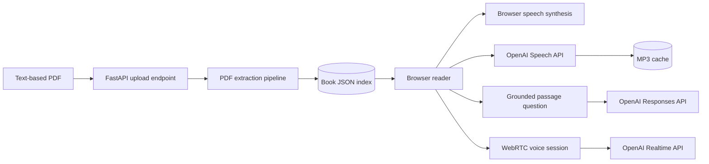

# Talking Book

Talking Book turns a text-based PDF into a page-aware, interruptible audiobook
with an AI reading companion. The long-term idea is a book that behaves less
like a static file and more like a live conversation: it reads, pauses, repeats,
explains, answers questions, and eventually listens for spoken commands and can
bring in outside research.

This repository is currently a working local pre-alpha vertical slice. The core
read → listen → interrupt → ask loop works in the browser. It is not yet a
hosted, multi-user product. Treat the current browser screen as a development
and testing console: reading, interruption, and book-navigation capabilities
should remain usable by a future voice-first client and should not depend on
where a book came from.

## Near-term scope

The immediate product slice is intentionally narrow: one local user, a small
local library, trustworthy extraction, and a good first-reading experience.
Accounts, synchronization, images, wake words, and production hosting remain
later roadmap items.

The quality gate is:

1. Prove that the extracted reading order is trustworthy.
2. Make the first session identify the book, skip non-reading material such as
   the table of contents, offer the preface when present, and begin the main
   text at the correct page and sentence.
3. Keep voice controls, passage annotations, and sourced research anchored to
   the authoritative sentence and physical PDF page.

## Project documents

- [Current project focus](PROJECT.md) — the scope, verified baseline, extraction
  plan, first-session milestone, and exact next task.
- [Manual smoke checklist](docs/SMOKE_TEST.md) — the repeatable browser and
  OpenAI narration checks used for user-facing changes.

## Current progress

| Area | Status | What exists now |
| --- | --- | --- |
| PDF ingestion | Working | Upload text-based PDFs up to 50 MB, validate the file, and avoid duplicate indexing by SHA-256 hash. |
| Book structure | Working | Preserve physical PDF pages and use publisher outlines when available; otherwise a bounded model scout can identify a source-verified opening for new uploads. |
| Reader | Working | Browse the library and table of contents, read by chapter, click any sentence, and see its physical PDF page. |
| Browser narration | Working | Continuous sentence-by-sentence playback using the browser's built-in speech engine. No API key required. |
| OpenAI narration | Working | Optional OpenAI speech generation with client prefetching and disk caching. The current voice is fixed to `alloy`. |
| Playback controls | Working | Play/continue, pause, previous sentence, next sentence, repeat paragraph, and speed from 0.7× to 1.6×. |
| Playback reliability | Working | Explicit Ready/Loading/Playing/Paused/Error state, stale-playback cancellation, two-sentence prefetch, and bounded client audio cache. |
| Reading memory | Working | Save position, speed, and narration mode per book in browser storage; offer to resume on return. |
| Reading companion | Working | Start a live voice conversation grounded in the current passage and nearby physical PDF pages; the text explanation endpoint remains available without occupying the primary reader UI. |
| Live voice conversation | Working | One on-demand WebRTC control pauses at the exact sentence, listens only when invoked, supports Continue/Repeat, cleans up media, and keeps a bounded 12-turn per-book transcript memory. |
| Automated verification | Working | 37 Python tests and 26 JavaScript tests currently pass, backed by a repeatable manual smoke checklist. |
| First-time reading experience | Working | With multiple books, one Play press starts a hands-free spoken choice of book and parser-verified opening; visible choices remain as fallbacks. Returning readers open their most recently used book. |
| Highlights and notes | Working | Spoken requests create local, page-anchored sentence or paragraph highlights and notes. |
| Voice selection and sleep timer | Later | Not implemented yet. |
| Passage actions and follow-up chat | Later | Explain works; Summarize, Define, Example, selected-text actions, and conversation history are not implemented. |
| Extraction QA | Current focus | Front matter and contents are excluded from normal narration; visible caption and cross-page paragraph artifacts still need targeted cleanup. |
| Spoken playback commands | Working | During an explicit on-demand conversation, natural Continue and Repeat requests control narration. Wake words and always-listening mode are not implemented. |
| Live web research | Working | A spoken research request uses sourced web search and stores the external result beside its anchored passage. |

## What you can do today

### Build a local library

- Upload a born-digital PDF through the browser.
- Switch between indexed books from the Library menu.
- Use a publisher-provided PDF outline as the table of contents.
- Keep the original page number attached to every extracted passage.
- On a first visit with multiple books, press Play once, allow the microphone,
  then say the book and parser-verified starting point you want. Visible choices
  remain available when Realtime or microphone access is unavailable.

### Read and navigate

- Read one outline section at a time in a clean, responsive interface.
- Click or keyboard-activate any sentence to make it the current reading cursor.
- Move one sentence backward or forward.
- Jump to the beginning of the current paragraph and replay it.
- See the current section, physical PDF page, and chapter progress.

### Listen

There are two narration paths:

1. **Browser voice** uses the Web Speech API built into the browser. It works
   without an OpenAI key and does not create server-side audio files.
2. **OpenAI voice** requests an MP3 for each sentence from the backend. It needs
   `OPENAI_API_KEY`, uses `tts-1` by default, and currently uses the `alloy`
   voice.

OpenAI narration preloads the next two sentences. The browser keeps at most 12
generated audio object URLs, while the backend stores generated MP3 files in
`data/audio/`. A cache key includes the TTS model, voice, and sentence text, so
replaying identical audio normally avoids another generation request.

Playback uses an incrementing token to invalidate old asynchronous work. This
prevents a late network response or old `onended` event from starting narration
after the reader has moved elsewhere.

At a readable section boundary, natural narration stops before speaking the
next section. The transition names the completed and upcoming sections and
selects the first sentence of the upcoming section as the saved reading cursor.
**Continue** starts it; **Pause here** leaves it ready for a returning session.
Manual Previous, Next, and Contents navigation remain direct controls and do
not force the transition prompt.

### Ask the book

The companion sends the current paragraph plus one neighboring paragraph on
each side to the OpenAI Responses API. Context is labeled with physical PDF page
numbers. Its system instruction requires answers to use only that supplied book
context and to admit when the context is insufficient.

This is intentionally grounded question answering, not full retrieval over the
entire book yet. Each request is independent; multi-turn chat memory and
follow-up context have not been added.

The **Ask by voice** button starts an explicit WebRTC session with the Realtime
API. Starting it stops narration first and freezes the authoritative sentence
cursor. The model receives that stopped sentence, its paragraph, section,
physical PDF page, nearby paragraphs, and at most 12 recent local transcript
turns. It waits for the reader to speak first. Saying Continue or pressing
**Continue reading** stops every microphone track, closes the voice session,
and resumes from the same sentence. A conversation started while the book was
already stopped shows **End voice** and leaves narration stopped.

During the live conversation, the model interprets natural requests through a
small set of validated tools instead of matching hardcoded phrases. It can
continue from the exact sentence, repeat the current paragraph, take a note,
highlight the current sentence or paragraph, or research a question connected
to the current passage. The browser validates every action and scope before
changing the authoritative cursor or saving anything.

Notes, highlights, and research are stored locally for the current book. Each
annotation keeps its exact quote, sentence cursor, and physical PDF page, so it
can be shown beside the passage and remapped by quote and page after a safe
re-analysis. Highlights appear directly on the text. Notes and research appear
under their paragraph; research is clearly labeled as external and retains up
to eight source links. Research uses the Responses API web-search tool and
requires `OPENAI_API_KEY`; notes and highlights do not make a second model call.

The microphone is not persistent during ordinary reading. Starting narration,
choosing another passage, saying Continue or Repeat, or pressing the visible
voice button ends the voice session before book audio resumes. This keeps book
narration and companion audio mutually exclusive while a reliable full-duplex
design is deferred.

### Continue where you stopped

For each book, the browser stores:

- current sentence index;
- narration speed;
- browser or OpenAI narration mode; and
- the time the session was last updated.

When a saved position exists, the returning-reader prompt identifies the saved
section, physical PDF page, and approximate progress through that section. The
reader can start over, request a short passage-grounded recap when OpenAI is
configured, or continue narration from the exact saved sentence.

On localhost, the sidebar includes **New reader** and **Returning reader** test
views. **New reader** ignores saved browser state on every reload without
deleting it. **Returning reader** uses that same saved state, so the two flows
can be tested repeatedly without clearing browser storage. These views are also
available directly at `?session=new` and `?session=returning`.

Saved data currently lives only in that browser's `localStorage`; it is not
synchronized between devices.

### Re-analyze an existing book

**Re-analyze book** runs the current parser and opening mapper against the
original uploaded PDF. The old index remains active until the replacement has
been extracted, mapped, and validated successfully. The reader then remaps the
saved cursor by physical PDF page and exact sentence text. If that sentence is
now classified as non-readable, the cursor moves to the nearest eligible
passage and the UI reports that adjustment. The original PDF is never replaced
or deleted by this action.

## Current local demo

This workspace currently contains an indexed copy of *Sapiens: A Brief History
of Humankind*:

| Metric | Current index |
| --- | ---: |
| Physical PDF pages | 439 |
| Publisher outline sections | 33 |
| Inferred paragraphs | 2,159 |
| Sentence reading segments | 8,152 |
| Extracted words | 141,548 |

The structured index is stored at `data/books/sapiens.json`. The `data/`
directory is intentionally ignored by Git because it can contain uploaded
books, extracted text, and generated audio.

## How it works



### Extraction pipeline

PDF files usually contain positioned characters rather than semantic
paragraphs. The parser combines three libraries with layout heuristics:

- `pypdf` reads metadata, encryption state, page count, and the publisher's PDF
  outline.
- `pdfplumber` extracts text lines with coordinates and font sizes.
- `pysbd` performs English sentence-boundary detection.

For each physical page, the parser:

1. extracts positioned text lines;
2. removes simple running page numbers near the page edges;
3. estimates the normal body font, left margin, and line spacing;
4. uses indentation, vertical gaps, and font-size changes to infer paragraph
   and heading boundaries;
5. removes likely line-wrap hyphens;
6. splits each paragraph into sentence-level narration segments; and
7. attaches every page, paragraph, and sentence to its active outline section.

This produces one JSON document per book. The document is written atomically
and cached in memory after loading.

For a newly uploaded PDF with no publisher outline, a configured OpenAI text
model examines extracted text from at most the first 15 pages, expanding once
to 30 pages when necessary. It proposes only the optional opening sections and
the first main section. The server applies a proposal only when every marker
quotes exact text found on the claimed physical PDF page. Otherwise the
existing extracted reading order is preserved and `opening_plan.status` is
`review_required`. The model never rewrites narration text.

### Book index schema

The top-level document contains:

```text
book
├── metadata: id, title, author, source filename, source SHA-256
├── counts: pages, words, sections, paragraphs, segments
├── opening_plan: mapping method, status, evidence, and scanned-page bound
├── reading_order: first eligible, preface, introduction, and main-text cursors
├── sections[]: outline title, depth, page/segment range, and reading role
├── pages[]: paragraph and segment ranges for each physical page
├── paragraphs[]: text, page, section, sentence range, and narration eligibility
└── segments[]: sentence text, page, section, paragraph, role, and eligibility
```

The sentence index is the authoritative reader cursor shared by navigation,
narration, progress persistence, and companion questions.

### Runtime architecture

- **Backend:** Python, FastAPI, and the OpenAI Python SDK.
- **Frontend:** dependency-free HTML, CSS, and modern JavaScript modules.
- **Book storage:** atomic JSON files in `data/books/`.
- **Uploaded PDFs:** `data/uploads/` when uploaded through the API.
- **Generated speech:** MP3 files in `data/audio/`.
- **Reader preferences:** browser `localStorage`, namespaced by book ID.
- **Database:** none at this stage.
- **Authentication:** none; this server is intended for local development only.

## Project structure

```text
Talking_book/
├── AGENTS.md                  Agent and engineering instructions
├── PROJECT.md                 Current scope, plan, status, and next task
├── app/
│   ├── book_mapper.py          Source-validated opening map for unbookmarked books
│   ├── main.py                 FastAPI routes and OpenAI integrations
│   ├── parser.py               Page-aware PDF extraction pipeline
│   └── store.py                Atomic JSON book store with in-memory cache
├── static/
│   ├── index.html              Reader, companion, and player markup
│   ├── styles.css              Responsive application styling
│   ├── app.js                  Reader state, API calls, and playback engine
│   └── playback_core.mjs       Pure playback calculations
├── scripts/
│   ├── check.sh                Local and CI quality gate
│   └── extract_book.py         Command-line index builder
├── tests/
│   ├── test_api.py             API, grounding, upload, and audio-cache tests
│   ├── test_parser.py          Layout and sentence parsing tests
│   └── playback_core.test.mjs  Playback helper tests
├── docs/
│   └── SMOKE_TEST.md            Manual regression checklist
├── data/                       Local generated data; ignored by Git
├── .env.example               Safe configuration template
├── pyproject.toml              Pytest configuration
├── requirements.txt           Runtime Python dependencies
├── requirements-dev.txt        Runtime plus test dependencies
└── .github/workflows/ci.yml    Reproducible CI quality check
```

## Local setup

### Prerequisites

- Python 3.11 or newer. The current environment uses Python 3.12.8.
- A modern browser with JavaScript enabled.
- Node.js only if you want to run the JavaScript tests. The current environment
  uses Node.js 23.11.0.
- An OpenAI API key only for model-guided opening maps, explanations, OpenAI
  narration, and live voice.

### 1. Create and activate the virtual environment

From the project folder:

```bash
python3 -m venv .venv
source .venv/bin/activate
```

Activation changes the current shell only. A typical prompt will show
`(.venv)`. Confirm which Python is active with:

```bash
which python
python --version
```

`which python` should point to this project's `.venv/bin/python`.

### 2. Install dependencies

For normal use:

```bash
python -m pip install --upgrade pip
python -m pip install -r requirements.txt
```

For development and tests:

```bash
python -m pip install -r requirements-dev.txt
```

### 3. Configure optional OpenAI features

```bash
cp .env.example .env
```

`cp` normally prints nothing when it succeeds. It creates a new hidden file
named `.env` from the `.env.example` template; it does not rename or overwrite
the template. Verify both files with:

```bash
ls -la .env*
```

Open `.env` in your editor and add the key:

```dotenv
OPENAI_API_KEY=your_key_here
OPENAI_TEXT_MODEL=gpt-5.6-luna
OPENAI_TTS_MODEL=tts-1
OPENAI_REALTIME_MODEL=gpt-realtime-2.1
OPENAI_REALTIME_VOICE=marin
```

The key is loaded only by the Python server. It is never included in frontend
JavaScript or returned by `/api/config`. `.env` is ignored by Git. Restart the
server after changing it.

If you leave the key empty, uploading, extraction, reading, navigation, saved
progress, and browser narration continue to work. Outline-free books keep the
parser's fallback opening and are marked for review. Model-guided opening maps,
AI explanations, OpenAI narration, and live voice are disabled.

### 4. Start the app

```bash
source .venv/bin/activate
uvicorn app.main:app --reload
```

Open <http://127.0.0.1:8000>.

Useful development URLs:

- App: <http://127.0.0.1:8000/>
- Health check: <http://127.0.0.1:8000/api/health>
- Interactive API documentation: <http://127.0.0.1:8000/docs>

Stop the server with `Ctrl+C`.

## Using the app

1. Open the local URL.
2. On a first visit with multiple books, press Play once, allow the microphone,
   and say which book you want. Returning readers open at their most recent book
   automatically.
3. Say whether to read the recommended preface/introduction or skip to the
   mapped main chapter. The visible choices are fallbacks. With one book, the
   app begins directly at this opening choice.
4. Alternatively, choose another existing book from **Library**, or click
   **Upload PDF**.
5. Wait while a new PDF is extracted. Large books can take around a minute or
   longer depending on the machine and document complexity.
6. Choose a chapter from **Contents** when you want to navigate manually.
7. Click a sentence and press Play.
8. Use Previous, Pause, Continue, Next, Repeat paragraph, and Speed as needed.
9. Enable **OpenAI voice** when a key is configured and cloud narration is
   desired.
10. Use the microphone to ask about the selected passage.

Uploading the same PDF again returns the existing book instead of parsing a
duplicate, based on the file's SHA-256 digest.

## Rebuild an index from the command line

The included extraction script is useful for large books or parser development:

```bash
source .venv/bin/activate
python scripts/extract_book.py "Sapiens A Brief History of Humankind.pdf" \
  --output data/books/sapiens.json
```

It reports periodic page progress and prints the resulting page, outline,
paragraph, sentence, and word counts. Restart the server after replacing an
index that it may already have cached.

## API

| Method | Path | Purpose |
| --- | --- | --- |
| `GET` | `/` | Serve the application. |
| `GET` | `/api/health` | Return server status and indexed book count. |
| `GET` | `/api/config` | Report whether OpenAI is configured and which model names are active. Never returns the API key. |
| `GET` | `/api/books` | List book summaries. |
| `GET` | `/api/books/{book_id}` | Return the complete structured book index. |
| `POST` | `/api/books` | Upload and index a text-based PDF. |
| `POST` | `/api/books/{book_id}/explain` | Answer a question grounded in the current passage. |
| `POST` | `/api/books/{book_id}/speech` | Generate or retrieve a cached MP3 for one sentence. |

Example health check:

```bash
curl http://127.0.0.1:8000/api/health
```

Example grounded question:

```bash
curl -X POST http://127.0.0.1:8000/api/books/BOOK_ID/explain \
  -H 'Content-Type: application/json' \
  -d '{"segment_index": 0, "question": "Explain this in simpler language."}'
```

Upload rules:

- filename must end in `.pdf`;
- content must start with the PDF signature;
- maximum size is 50 MiB;
- invalid PDFs return HTTP 415;
- oversized files return HTTP 413; and
- extraction failures return HTTP 422.

## Configuration

| Environment variable | Default | Purpose |
| --- | --- | --- |
| `OPENAI_API_KEY` | empty | Enables source-validated opening maps, explanations, OpenAI speech generation, and live voice. |
| `OPENAI_TEXT_MODEL` | `gpt-5.6-luna` | Model used by the opening mapper and passage companion. |
| `OPENAI_TTS_MODEL` | `tts-1` | Model used for generated narration. |
| `OPENAI_REALTIME_MODEL` | `gpt-realtime-2.1` | Model used for live voice conversation. |
| `OPENAI_REALTIME_VOICE` | `marin` | Voice used by the live companion. |

## Testing

Run all current tests from an activated environment:

```bash
python -m pytest -q
node --test tests/*.test.mjs
node --check static/app.js
```

Current verified result:

```text
Python:     34 passed
JavaScript: 20 passed
Syntax:     static/app.js valid
```

The Python suite covers paragraph inference, dehyphenation, sentence splitting,
source-validated opening maps and safe fallbacks, golden reading-role and
start-cursor expectations, book endpoints, missing-key behavior, grounded
prompt construction, speech generation caching, and invalid upload rejection.
The JavaScript suite also verifies that narration skips
non-readable segments, honors explicit preface and main-text start cursors, and
checks the live voice lifecycle and bounded transcript-memory helpers.

## Engineering checks

The repository has one repeatable quality gate for local work and CI:

```bash
source .venv/bin/activate
bash scripts/check.sh
```

It runs the Python tests, JavaScript tests, frontend syntax check, and Python
bytecode compilation. The project rules that guide coding agents live in
[`AGENTS.md`](AGENTS.md). A project-local Codex Stop hook is also configured in
[`.codex/hooks.json`](.codex/hooks.json); review and trust it in Codex's
`/hooks` panel before relying on automatic stop-time checks.

## Data, privacy, cost, and security

- The application is designed for local development and has no authentication.
  Do not expose it directly to the public internet.
- Uploaded PDFs and extracted text stay under `data/` unless an OpenAI feature
  is used.
- When an API key is configured, uploading an outline-free book sends extracted
  text from at most its first 30 physical PDF pages to the configured OpenAI
  text model so the opening can be mapped. The response is not stored by the
  API request, and proposed markers are checked against local source text.
- Asking a question sends the nearby extracted passage and the reader's question
  to the configured OpenAI API.
- OpenAI narration sends one sentence at a time to the configured speech model.
- Cloud explanations and first-time speech generations can incur API usage.
  Cached speech avoids repeated generation for identical model/voice/text input.
- `.env`, `.venv`, generated data, caches, and Python bytecode are ignored by
  Git. Do not commit API keys or copyrighted book files.

## Current limitations

- Only PDF uploads are accepted; EPUB and other ebook formats are not supported.
- Scanned-image PDFs do not have OCR support and may produce little or no text.
- Outline-free novels and general nonfiction can receive a verified opening
  section from the model, but later chapter boundaries are not mapped yet.
- Layout reconstruction is heuristic. Headers, captions, footnotes, marginalia,
  and multi-column pages can be classified incorrectly.
- Paragraphs split across physical page boundaries are not joined.
- Outline-classified table-of-contents and front-matter sections are excluded
  from narration, but captions and other non-prose blocks within chapters can
  still be read.
- The hands-free first-session welcome requires Realtime and microphone access;
  browser speech plus visible book and opening choices remain as fallbacks.
- English sentence segmentation is configured; multilingual books need language
  detection and appropriate segmenters.
- The OpenAI narration voice is fixed to `alloy`; there is no voice picker yet.
- The companion sees a small local context window, not the whole book. Live
  voice keeps only 12 transcript turns per book in that browser.
- Microphone use requires the explicit Ask by voice action and ends before book
  narration resumes. Persistent listening, wake words, relative or semantic
  navigation, and other controls do not exist yet.
- Notes, highlights, and research are local to one browser and cannot yet be
  edited, deleted, exported, or synchronized. Bookmarks, sleep timers, and
  reading goals are not implemented.
- There is no delete-book UI, user account system, database, background job
  queue, deployment configuration, or production observability.
- The visible sidebar-collapse control is not wired up yet.

## Incremental roadmap

The guiding principle is to keep reading and explicit live conversation
reliable before adding autonomous voice controls.

### Completed foundation

- page-aware PDF ingestion and structured JSON index;
- library, table of contents, chapter reader, and clickable sentence cursor;
- browser and OpenAI narration;
- pause/continue, sentence navigation, paragraph repeat, and speed control;
- playback status, cancellation, prefetch, and caching safeguards;
- per-book progress and preference persistence;
- grounded “Explain this” interaction;
- passage-anchored notes, highlights, and sourced research; and
- automated parser, API, and playback-helper tests.

### Verified: live conversation

- API and JavaScript regressions verify exact stopped-sentence grounding,
  on-demand silence, validated Continue/Repeat actions, transcript memory, and
  media cleanup;
- a no-permission browser check verifies the visible Ask by voice control and
  removal of persistent listening without console errors; and
- the current on-demand loop still needs the real-key manual check in
  `docs/SMOKE_TEST.md`.

### Current focus: extraction trust

- listen through the real Sapiens opening and fix only artifacts that disrupt
  narration;
- exclude caption-like blocks within chapters when they are clearly detected;
  and
- join obvious paragraphs that continue across physical page boundaries.

### Implemented: first-time reading experience

- welcome a first-time reader and ask them to choose when multiple books exist;
- open the latest started book for a returning reader;
- identify the selected book and its author;
- recommend a detected preface or introduction and the opening sections that
  follow it;
- offer a separate direct start at the first eligible main-text segment; and
- keep the current sentence and physical page visible and correct.

### Later: reader comfort and memory

- annotation editing, deletion, export, and synchronization;
- bookmarks;
- voice selection for OpenAI narration;
- convenient speed presets;
- sleep timer and stop-at-end-of-chapter option; and
- finish the collapsible/sidebar behavior on smaller screens.

### Next: make the text interactive

- select arbitrary text instead of only the current sentence;
- one-tap Explain, Summarize, Define, and Give an example actions;
- page-cited answers displayed as structured references;
- multi-turn follow-up questions tied to a passage; and
- book-wide retrieval when the local paragraph window is insufficient.

### Later: broader spoken and research capabilities

- wake-word activation and hands-free session control;
- book-wide retrieval and semantic voice navigation;
- richer conversation history and saved-insight review; and
- accounts, synchronization, production storage, background extraction jobs,
  deployment, and monitoring.

## Definition of the current milestone

The current milestone is successful when a reader can open a text-based PDF,
select a chapter and sentence, listen continuously, interrupt or navigate
without overlapping audio, return to the saved position, and ask for a grounded
explanation of the current passage. That milestone is implemented and tested.

The next meaningful milestone is validating the voice-first welcome and
annotation flows with real readers while continuing to close the frozen parser
benchmark gaps without book-specific rules.
