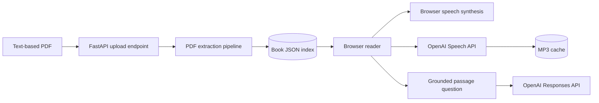

# Talking Book

Talking Book turns a text-based PDF into a page-aware, interruptible audiobook
with an AI reading companion. The long-term idea is a book that behaves less
like a static file and more like a live conversation: it reads, pauses, repeats,
explains, answers questions, and eventually listens for spoken commands and can
bring in outside research.

This repository is currently a working local pre-alpha vertical slice. The core
read → listen → interrupt → ask loop works in the browser. It is not yet a
hosted, multi-user product.

## Project documents

- [Product vision](VISION.md) — the complete voice-first reader experience and
  final-product principles.
- [Incremental implementation plan](IMPLEMENTATION_PLAN.md) — the cumulative,
  phase-by-phase roadmap from the current reader to that vision.
- [Manual smoke checklist](docs/SMOKE_TEST.md) — the repeatable browser and
  OpenAI narration checks used before each roadmap phase is considered stable.

## Current progress

| Area | Status | What exists now |
| --- | --- | --- |
| PDF ingestion | Working | Upload text-based PDFs up to 50 MB, validate the file, and avoid duplicate indexing by SHA-256 hash. |
| Book structure | Working | Preserve physical PDF pages, publisher outline sections, inferred paragraphs, and sentence-level reading segments. |
| Reader | Working | Browse the library and table of contents, read by chapter, click any sentence, and see its physical PDF page. |
| Browser narration | Working | Continuous sentence-by-sentence playback using the browser's built-in speech engine. No API key required. |
| OpenAI narration | Working | Optional OpenAI speech generation with client prefetching and disk caching. The current voice is fixed to `alloy`. |
| Playback controls | Working | Play/continue, pause, previous sentence, next sentence, repeat paragraph, and speed from 0.7× to 1.6×. |
| Playback reliability | Working | Explicit Ready/Loading/Playing/Paused/Error state, stale-playback cancellation, two-sentence prefetch, and bounded client audio cache. |
| Reading memory | Working | Save position, speed, and narration mode per book in browser storage; offer to resume on return. |
| Reading companion | Working | Ask a question about the current passage and receive an answer grounded in the surrounding book text and PDF page numbers. |
| Automated verification | Working | 14 Python tests and 5 JavaScript tests currently pass, backed by a repeatable manual smoke checklist. |
| Bookmarks and notes | Next | Not implemented yet. |
| Voice selection and sleep timer | Next | Not implemented yet. |
| Passage actions and follow-up chat | Next | Explain works; Summarize, Define, Example, selected-text actions, and conversation history are not implemented. |
| Parsing corrections | Planned | No UI yet for editing extracted text, joining paragraphs, or classifying headings/captions/footnotes. |
| Microphone commands | Planned | Spoken “pause,” “repeat,” and “explain that” commands are not implemented yet. |
| Live web research | Planned | The companion currently uses only local book context; it does not search the web or collect outside commentary. |

## What you can do today

### Build a local library

- Upload a born-digital PDF through the browser.
- Switch between indexed books from the Library menu.
- Use a publisher-provided PDF outline as the table of contents.
- Keep the original page number attached to every extracted passage.

### Read and navigate

- Read one outline section at a time in a clean, responsive interface.
- Click or keyboard-activate any sentence to make it the current reading cursor.
- Move one sentence backward or forward.
- Jump to the beginning of the current paragraph and replay it.
- See the current section, physical PDF page, and chapter progress.

### Listen

There are two narration paths:

1. **Browser voice** uses the Web Speech API built into the browser. It works
   without an OpenAI key and does not create server-side audio files.
2. **OpenAI voice** requests an MP3 for each sentence from the backend. It needs
   `OPENAI_API_KEY`, uses `tts-1` by default, and currently uses the `alloy`
   voice.

OpenAI narration preloads the next two sentences. The browser keeps at most 12
generated audio object URLs, while the backend stores generated MP3 files in
`data/audio/`. A cache key includes the TTS model, voice, and sentence text, so
replaying identical audio normally avoids another generation request.

Playback uses an incrementing token to invalidate old asynchronous work. This
prevents a late network response or old `onended` event from starting narration
after the reader has moved elsewhere.

### Ask the book

The companion sends the current paragraph plus one neighboring paragraph on
each side to the OpenAI Responses API. Context is labeled with physical PDF page
numbers. Its system instruction requires answers to use only that supplied book
context and to admit when the context is insufficient.

This is intentionally grounded question answering, not full retrieval over the
entire book yet. Each request is independent; multi-turn chat memory and
follow-up context have not been added.

### Continue where you stopped

For each book, the browser stores:

- current sentence index;
- narration speed;
- browser or OpenAI narration mode; and
- the time the session was last updated.

When a saved position differs from the default opening passage, the reader
offers a **Continue where you left off** prompt. This data currently lives only
in that browser's `localStorage`; it is not synchronized between devices.

## Current local demo

This workspace currently contains an indexed copy of *Sapiens: A Brief History
of Humankind*:

| Metric | Current index |
| --- | ---: |
| Physical PDF pages | 439 |
| Publisher outline sections | 33 |
| Inferred paragraphs | 2,159 |
| Sentence reading segments | 8,152 |
| Extracted words | 141,548 |

The structured index is stored at `data/books/sapiens.json`. The `data/`
directory is intentionally ignored by Git because it can contain uploaded
books, extracted text, and generated audio.

## How it works



### Extraction pipeline

PDF files usually contain positioned characters rather than semantic
paragraphs. The parser combines three libraries with layout heuristics:

- `pypdf` reads metadata, encryption state, page count, and the publisher's PDF
  outline.
- `pdfplumber` extracts text lines with coordinates and font sizes.
- `pysbd` performs English sentence-boundary detection.

For each physical page, the parser:

1. extracts positioned text lines;
2. removes simple running page numbers near the page edges;
3. estimates the normal body font, left margin, and line spacing;
4. uses indentation, vertical gaps, and font-size changes to infer paragraph
   and heading boundaries;
5. removes likely line-wrap hyphens;
6. splits each paragraph into sentence-level narration segments; and
7. attaches every page, paragraph, and sentence to its active outline section.

This produces one JSON document per book. The document is written atomically
and cached in memory after loading.

### Book index schema

The top-level document contains:

```text
book
├── metadata: id, title, author, source filename, source SHA-256
├── counts: pages, words, sections, paragraphs, segments
├── sections[]: outline title, depth, page range, segment range
├── pages[]: paragraph and segment ranges for each physical page
├── paragraphs[]: text, page, section, and sentence range
└── segments[]: sentence text, page, section, and paragraph index
```

The sentence index is the authoritative reader cursor shared by navigation,
narration, progress persistence, and companion questions.

### Runtime architecture

- **Backend:** Python, FastAPI, and the OpenAI Python SDK.
- **Frontend:** dependency-free HTML, CSS, and modern JavaScript modules.
- **Book storage:** atomic JSON files in `data/books/`.
- **Uploaded PDFs:** `data/uploads/` when uploaded through the API.
- **Generated speech:** MP3 files in `data/audio/`.
- **Reader preferences:** browser `localStorage`, namespaced by book ID.
- **Database:** none at this stage.
- **Authentication:** none; this server is intended for local development only.

## Project structure

```text
Talking_book/
├── AGENTS.md                  Agent and engineering instructions
├── app/
│   ├── main.py                 FastAPI routes and OpenAI integrations
│   ├── parser.py               Page-aware PDF extraction pipeline
│   └── store.py                Atomic JSON book store with in-memory cache
├── static/
│   ├── index.html              Reader, companion, and player markup
│   ├── styles.css              Responsive application styling
│   ├── app.js                  Reader state, API calls, and playback engine
│   └── playback_core.mjs       Pure playback calculations
├── scripts/
│   ├── check.sh                Local and CI quality gate
│   └── extract_book.py         Command-line index builder
├── tests/
│   ├── test_api.py             API, grounding, upload, and audio-cache tests
│   ├── test_parser.py          Layout and sentence parsing tests
│   └── playback_core.test.mjs  Playback helper tests
├── data/                       Local generated data; ignored by Git
├── .env.example               Safe configuration template
├── pyproject.toml              Pytest configuration
├── requirements.txt           Runtime Python dependencies
├── requirements-dev.txt        Runtime plus test dependencies
└── .github/workflows/ci.yml    Reproducible CI quality check
```

## Local setup

### Prerequisites

- Python 3.11 or newer. The current environment uses Python 3.12.8.
- A modern browser with JavaScript enabled.
- Node.js only if you want to run the JavaScript tests. The current environment
  uses Node.js 23.11.0.
- An OpenAI API key only for AI explanations and OpenAI narration.

### 1. Create and activate the virtual environment

From the project folder:

```bash
python3 -m venv .venv
source .venv/bin/activate
```

Activation changes the current shell only. A typical prompt will show
`(.venv)`. Confirm which Python is active with:

```bash
which python
python --version
```

`which python` should point to this project's `.venv/bin/python`.

### 2. Install dependencies

For normal use:

```bash
python -m pip install --upgrade pip
python -m pip install -r requirements.txt
```

For development and tests:

```bash
python -m pip install -r requirements-dev.txt
```

### 3. Configure optional OpenAI features

```bash
cp .env.example .env
```

`cp` normally prints nothing when it succeeds. It creates a new hidden file
named `.env` from the `.env.example` template; it does not rename or overwrite
the template. Verify both files with:

```bash
ls -la .env*
```

Open `.env` in your editor and add the key:

```dotenv
OPENAI_API_KEY=your_key_here
OPENAI_TEXT_MODEL=gpt-5.6-luna
OPENAI_TTS_MODEL=tts-1
```

The key is loaded only by the Python server. It is never included in frontend
JavaScript or returned by `/api/config`. `.env` is ignored by Git. Restart the
server after changing it.

If you leave the key empty, uploading, extraction, reading, navigation, saved
progress, and browser narration continue to work. Only AI explanations and
OpenAI narration are disabled.

### 4. Start the app

```bash
source .venv/bin/activate
uvicorn app.main:app --reload
```

Open <http://127.0.0.1:8000>.

Useful development URLs:

- App: <http://127.0.0.1:8000/>
- Health check: <http://127.0.0.1:8000/api/health>
- Interactive API documentation: <http://127.0.0.1:8000/docs>

Stop the server with `Ctrl+C`.

## Using the app

1. Open the local URL.
2. Choose an existing book from **Library**, or click **Upload PDF**.
3. Wait while the PDF is extracted. Large books can take around a minute or
   longer depending on the machine and document complexity.
4. Choose a chapter from **Contents**.
5. Click a sentence and press Play.
6. Use Previous, Pause, Continue, Next, Repeat paragraph, and Speed as needed.
7. Enable **OpenAI voice** when a key is configured and cloud narration is
   desired.
8. Type a question in **Book companion** to ask about the selected passage.

Uploading the same PDF again returns the existing book instead of parsing a
duplicate, based on the file's SHA-256 digest.

## Rebuild an index from the command line

The included extraction script is useful for large books or parser development:

```bash
source .venv/bin/activate
python scripts/extract_book.py "Sapiens A Brief History of Humankind.pdf" \
  --output data/books/sapiens.json
```

It reports periodic page progress and prints the resulting page, outline,
paragraph, sentence, and word counts. Restart the server after replacing an
index that it may already have cached.

## API

| Method | Path | Purpose |
| --- | --- | --- |
| `GET` | `/` | Serve the application. |
| `GET` | `/api/health` | Return server status and indexed book count. |
| `GET` | `/api/config` | Report whether OpenAI is configured and which model names are active. Never returns the API key. |
| `GET` | `/api/books` | List book summaries. |
| `GET` | `/api/books/{book_id}` | Return the complete structured book index. |
| `POST` | `/api/books` | Upload and index a text-based PDF. |
| `POST` | `/api/books/{book_id}/explain` | Answer a question grounded in the current passage. |
| `POST` | `/api/books/{book_id}/speech` | Generate or retrieve a cached MP3 for one sentence. |

Example health check:

```bash
curl http://127.0.0.1:8000/api/health
```

Example grounded question:

```bash
curl -X POST http://127.0.0.1:8000/api/books/BOOK_ID/explain \
  -H 'Content-Type: application/json' \
  -d '{"segment_index": 0, "question": "Explain this in simpler language."}'
```

Upload rules:

- filename must end in `.pdf`;
- content must start with the PDF signature;
- maximum size is 50 MiB;
- invalid PDFs return HTTP 415;
- oversized files return HTTP 413; and
- extraction failures return HTTP 422.

## Configuration

| Environment variable | Default | Purpose |
| --- | --- | --- |
| `OPENAI_API_KEY` | empty | Enables explanations and OpenAI speech generation. |
| `OPENAI_TEXT_MODEL` | `gpt-5.6-luna` | Model used by the passage companion. |
| `OPENAI_TTS_MODEL` | `tts-1` | Model used for generated narration. |

## Testing

Run all current tests from an activated environment:

```bash
python -m pytest -q
node --test tests/playback_core.test.mjs
node --check static/app.js
```

Current verified result:

```text
Python:     8 passed
JavaScript: 3 passed
Syntax:     static/app.js valid
```

The Python suite covers paragraph inference, dehyphenation, sentence splitting,
book endpoints, missing-key behavior, grounded prompt construction, speech
generation caching, and invalid upload rejection. The JavaScript suite covers
cursor validation, bounded movement, chapter-progress calculation, and prefetch
selection.

## Engineering checks

The repository has one repeatable quality gate for local work and CI:

```bash
source .venv/bin/activate
bash scripts/check.sh
```

It runs the Python tests, JavaScript tests, frontend syntax check, and Python
bytecode compilation. The project rules that guide coding agents live in
[`AGENTS.md`](AGENTS.md). A project-local Codex Stop hook is also configured in
[`.codex/hooks.json`](.codex/hooks.json); review and trust it in Codex's
`/hooks` panel before relying on automatic stop-time checks.

## Data, privacy, cost, and security

- The application is designed for local development and has no authentication.
  Do not expose it directly to the public internet.
- Uploaded PDFs and extracted text stay under `data/` unless an OpenAI feature
  is used.
- Asking a question sends the nearby extracted passage and the reader's question
  to the configured OpenAI API.
- OpenAI narration sends one sentence at a time to the configured speech model.
- Cloud explanations and first-time speech generations can incur API usage.
  Cached speech avoids repeated generation for identical model/voice/text input.
- `.env`, `.venv`, generated data, caches, and Python bytecode are ignored by
  Git. Do not commit API keys or copyrighted book files.

## Current limitations

- Only PDF uploads are accepted; EPUB and other ebook formats are not supported.
- Scanned-image PDFs do not have OCR support and may produce little or no text.
- The reader currently relies on a usable publisher PDF outline for chapter
  navigation. Outline-free PDFs need a generated-section fallback.
- Layout reconstruction is heuristic. Headers, captions, footnotes, marginalia,
  and multi-column pages can be classified incorrectly.
- Paragraphs split across physical page boundaries are not joined.
- English sentence segmentation is configured; multilingual books need language
  detection and appropriate segmenters.
- The OpenAI narration voice is fixed to `alloy`; there is no voice picker yet.
- The companion sees a small local context window, not the whole book, and does
  not keep conversation history.
- No web search, external reviews, or real-time commentary retrieval exists yet.
- No microphone input, wake word, or spoken playback commands exist yet.
- Bookmarks, highlights, notes, sleep timer, reading goals, and cross-device sync
  are not implemented.
- There is no delete-book UI, user account system, database, background job
  queue, deployment configuration, or production observability.
- The visible sidebar-collapse control is not wired up yet.

## Incremental roadmap

The guiding principle is to make reading interaction reliable before adding a
fully live voice layer.

### Completed foundation

- page-aware PDF ingestion and structured JSON index;
- library, table of contents, chapter reader, and clickable sentence cursor;
- browser and OpenAI narration;
- pause/continue, sentence navigation, paragraph repeat, and speed control;
- playback status, cancellation, prefetch, and caching safeguards;
- per-book progress and preference persistence;
- grounded “Explain this” interaction; and
- automated parser, API, and playback-helper tests.

### Next: reader comfort and memory

- bookmarks with optional notes;
- voice selection for OpenAI narration;
- convenient speed presets;
- sleep timer and stop-at-end-of-chapter option; and
- finish the collapsible/sidebar behavior on smaller screens.

### Next: make the text interactive

- select arbitrary text instead of only the current sentence;
- one-tap Explain, Summarize, Define, and Give an example actions;
- page-cited answers displayed as structured references;
- multi-turn follow-up questions tied to a passage; and
- book-wide retrieval when the local paragraph window is insufficient.

### Next: improve imperfect extraction

- automatically skip or classify page numbers, running headers, captions,
  footnotes, and headings during narration;
- join paragraphs that continue across page boundaries;
- let the reader edit extracted text and change a block's type; and
- persist corrections without modifying the source PDF.

### Later: live conversation and research

- microphone controls such as “wait,” “continue,” “repeat that,” and “explain
  this”;
- interruption-aware, low-latency voice conversation;
- optional real-time web research for reviews, historical context, and other
  readers' interpretations, clearly separated from claims in the book;
- conversation history and saved insights; and
- accounts, synchronization, production storage, background extraction jobs,
  deployment, and monitoring.

## Definition of the current milestone

The current milestone is successful when a reader can open a text-based PDF,
select a chapter and sentence, listen continuously, interrupt or navigate
without overlapping audio, return to the saved position, and ask for a grounded
explanation of the current passage. That milestone is implemented and tested.

The next meaningful milestone is a comfortable daily reader: bookmarks and
notes, selectable narration voices, sleep controls, richer passage actions, and
better handling of extraction mistakes. Spoken commands come after those
interactions are dependable.
